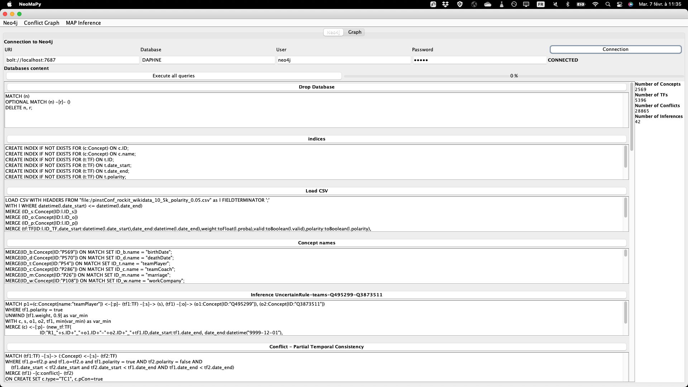
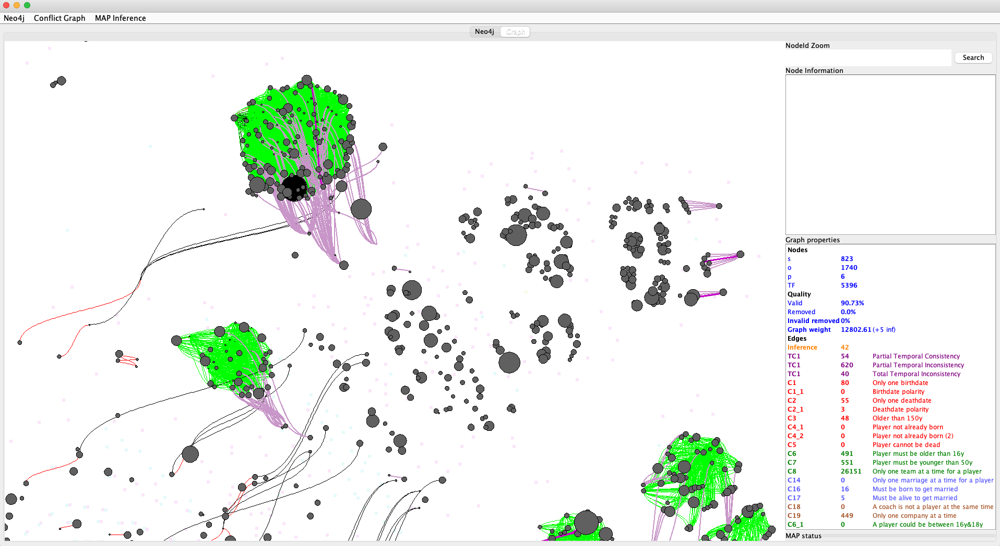
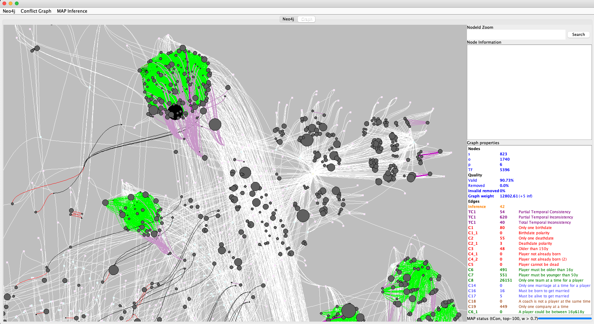
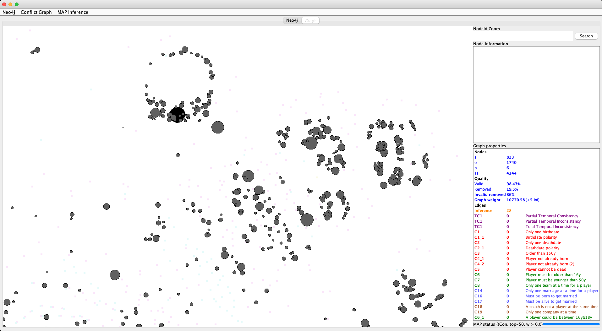
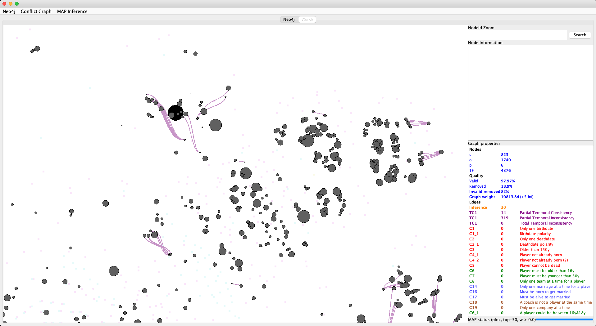
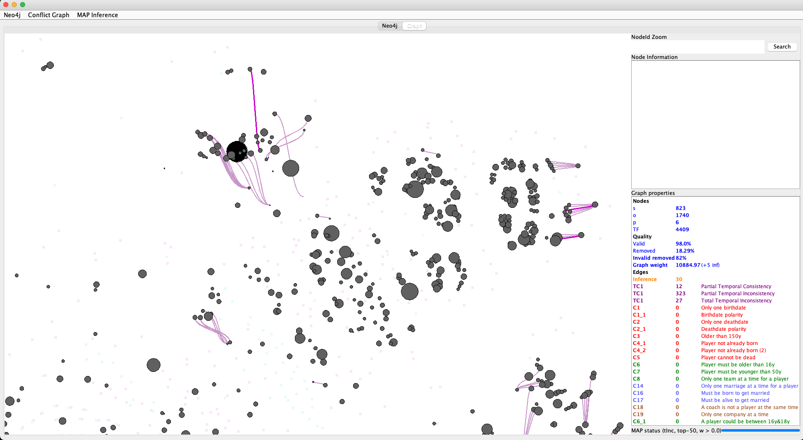

# The *NeoMaPy* GUI

This program is developped in Java. It's a GUI that visualize the interactions with the *NeoMaPy Graph*:
- Import the graph into **Neo4j**. **MANDATORY!!!** It requires a living [Neo4j](https://neo4j.com/download-center/) database instance - connection can be set in the config file ([conf](conf) folder)
- Process **Cypher queries** which translates conflictual rules applied on the graph ([CypherQueries](CypherQueries) folder)
- Extract, **visualize** and interact with the graph in the GUI (it relies on [**GraphStream**](https://graphstream-project.org)). The CSS files is available [here](conf/NeoMaPy.css) which gives each color to the conflicts (edges) and nodes.
- Compute the **MAP inference** with the Python script [**MaPy**](https://github.com/cedric-cnam/NeoMaPy_Daphne/tree/main/MAP_Inference). Naïve strategies are also provided to see the efficiency of the MAP inference.

## NeoMaPy Screenshots

### Graph Management
- Connection to Neo4j
- Cypher queries to: import the CSV file, add information to nodes, compute conflicts (rules), inference rules, etc.
- Global graph statistics

### Global conflict graph

Show linked TF (*temporal facts*)
 

Show hidden (s,o,p) linked to any TF. 

### MAP Inference

Show different semantics of MAP inference

#### tCon

#### pInc

#### tInc

#### tCon + weight > 0.7

### Created by Nicolas Travers nicolas.travers@devinci.fr 2022-2023©
