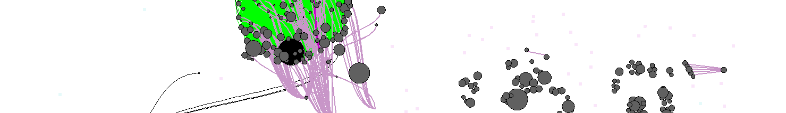

# **NeoMaPy**

Work on the Uncertain Temporal Knowledge Graphs in the French [ANR Daphné project](https://anr.fr/Projet-ANR-17-CE38-0013).

## Neo4J
- Extraction of evidences from n-Rockit files, translation to CSV format
- Import into Neo4j
- Constraints & Rules translated to Cypher queries
- Queries to export conflicts
- Experiments on NeoMaPy

## MAP inference
- Python program that produces the **MAP inference** according to various semantics and parameters
- It relies on the Neo4j database using the conflicts

## NeoMaPy

The GUI developped on top of the two previous steps (graph creation and extraction and MaPy computation).
This steps corresponds to the demonstration of this work.
